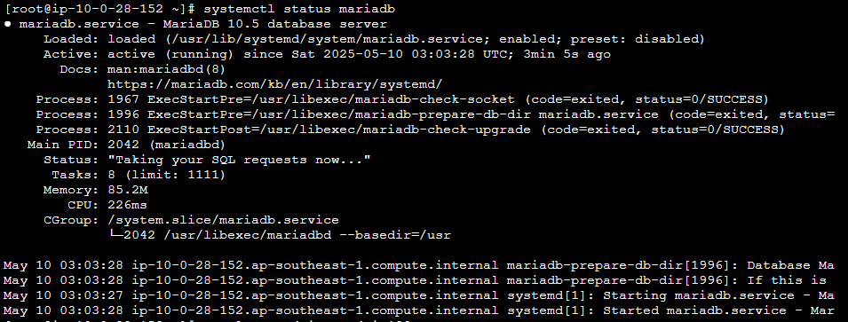
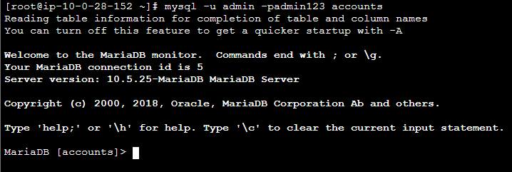
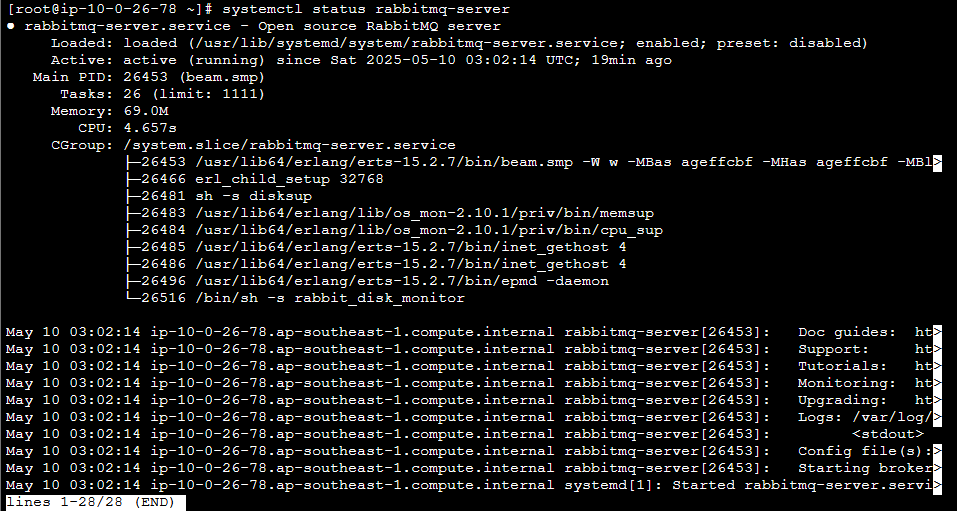

# AWS-Cloud-for-Project-Set-Up-Lift-Shift


##  1.First Create Three Security Groups


 ####  1.1 Create for ELB

- Allow inbound rules for http,https from ipv4 and ipv6

####   1.2 Create for App

- Allow inbound rules for 8080 from ELB Security Group
- Allow inbound rules for ssh from your ip

####    1.3 Create for backend

- Allow inbound rules for 3306 from App Security Group
- Allow inbound rules for 11211 from App Security Group
- Allow inbound rules for 5672 from App Security Group
- Allow inbound rules for ssh from your ip


##  2. Create Three Instances by using User Data Script

#### 2.1 User Data for mysql

```
#!/bin/bash
DATABASE_PASS='admin123'
sudo dnf update -y
sudo dnf install git zip unzip -y
sudo dnf install mariadb105-server -y
# starting & enabling mariadb-server
sudo systemctl start mariadb
sudo systemctl enable mariadb
cd /tmp/
git clone -b awsliftandshift https://github.com/hkhcoder/vprofile-project.git
#restore the dump file for the application
sudo mysqladmin -u root password "$DATABASE_PASS"
sudo mysql -u root -p"$DATABASE_PASS" -e "ALTER USER 'root'@'localhost' IDENTIFIED BY '$DATABASE_PASS'"
sudo mysql -u root -p"$DATABASE_PASS" -e "DELETE FROM mysql.user WHERE User='root' AND Host NOT IN ('localhost', '127.0.0.1', '::1')"
sudo mysql -u root -p"$DATABASE_PASS" -e "DELETE FROM mysql.user WHERE User=''"
sudo mysql -u root -p"$DATABASE_PASS" -e "DELETE FROM mysql.db WHERE Db='test' OR Db='test\_%'"
sudo mysql -u root -p"$DATABASE_PASS" -e "FLUSH PRIVILEGES"
sudo mysql -u root -p"$DATABASE_PASS" -e "create database accounts"
sudo mysql -u root -p"$DATABASE_PASS" -e "grant all privileges on accounts.* TO 'admin'@'localhost' identified by 'admin123'"
sudo mysql -u root -p"$DATABASE_PASS" -e "grant all privileges on accounts.* TO 'admin'@'%' identified by 'admin123'"
sudo mysql -u root -p"$DATABASE_PASS" accounts < /tmp/vprofile-project/src/main/resources/db_backup.sql
sudo mysql -u root -p"$DATABASE_PASS" -e "FLUSH PRIVILEGES"
```

#### 2.2 Create EC2

- Security must be backend security group.
- Image Amazon 2023 AMI


#### 2.3  User Data for memcache

```
#!/bin/bash
sudo dnf install memcached -y
sudo systemctl start memcached
sudo systemctl enable memcached
sudo systemctl status memcached
sed -i 's/127.0.0.1/0.0.0.0/g' /etc/sysconfig/memcached
sudo systemctl restart memcached
sudo memcached -p 11211 -U 11111 -u memcached -d
```

#### 2.4 Create EC2

- Security must be backend security group.
- Image Amazon 2023 AMI


#### 2.5  User Data for rabbitmq

```
#!/bin/bash
## primary RabbitMQ signing key
rpm --import 'https://github.com/rabbitmq/signing-keys/releases/download/3.0/rabbitmq-release-signing-key.asc'
## modern Erlang repository
rpm --import 'https://github.com/rabbitmq/signing-keys/releases/download/3.0/cloudsmith.rabbitmq-erlang.E495BB49CC4BBE5B.key'
## RabbitMQ server repository
rpm --import 'https://github.com/rabbitmq/signing-keys/releases/download/3.0/cloudsmith.rabbitmq-server.9F4587F226208342.key'
curl -o /etc/yum.repos.d/rabbitmq.repo https://raw.githubusercontent.com/hkhcoder/vprofile-project/refs/heads/awsliftandshift/al2023rmq.repo
dnf update -y
## install these dependencies from standard OS repositories
dnf install socat logrotate -y
## install RabbitMQ and zero dependency Erlang
dnf install -y erlang rabbitmq-server
systemctl enable rabbitmq-server
systemctl start rabbitmq-server
sudo sh -c 'echo "[{rabbit, [{loopback_users, []}]}]." > /etc/rabbitmq/rabbitmq.config'
sudo rabbitmqctl add_user test test
sudo rabbitmqctl set_user_tags test administrator
rabbitmqctl set_permissions -p / test ".*" ".*" ".*"

sudo systemctl restart rabbitmq-server
```


#### 2.6 Create EC2

- Security must be backend security group.
- Image Amazon 2023 AMI


#### 2.7  User Data for tomcat_ubuntu

```
#!/bin/bash
sudo apt update
sudo apt upgrade -y
sudo apt install openjdk-17-jdk -y
sudo apt install tomcat10 tomcat10-admin tomcat10-docs tomcat10-common git -y
```

#### 2.8 Create EC2

- Security must be app security group.
- Image Ubuntu 24


#### 2.9 Log in to APP EC2

-  check mariadb status

```
systemctl status mariadb
```




-  check mariadb db

```
mysql -u admin -p accounts
```




#### 2.10    Log in to Memcache EC2

-  check memcache status

```
systemctl status memcached
```


#### 2.11    Log in to Rabbitmq EC2

-  check rabbitmq status

```
systemctl status rabbitmq-server
```


